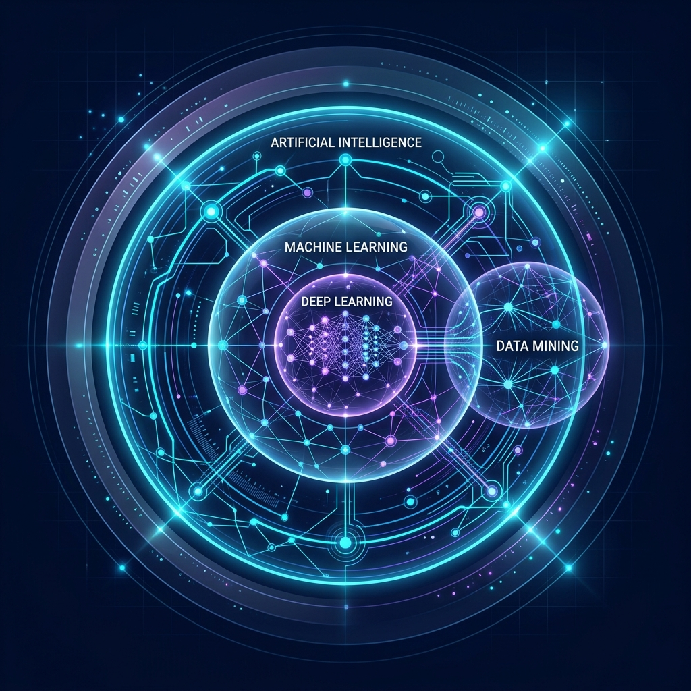

# Arif Hidayah - Web Profil & Media Ajar Interaktif 👨‍🏫💻

Proyek ini adalah sebuah platform web terintegrasi yang berfungsi ganda sebagai **Web Profil Profesional** dan **Sistem Media Pembelajaran (LMS) Interaktif** untuk materi perkuliahan mahasiswa (Data Mining, Web Dev, Mobile Dev).



## 🚀 Fitur Utama
1. **Profil Profesional (Landing Page)**
   - Desain modern dengan *Dark Mode*, *Glassmorphism*, dan animasi interaktif.
   - Integrasi langsung data ringkasan pengalaman dan latar belakang pendidikan.
2. **Modul Pembelajaran Interaktif (LMS)**
   - Tata letak terstruktur dengan kombinasi Flexbox Sidebar dan Main Content.
   - Dukungan komponen tipografi khusus untuk definisi, blok kode ber-syntax highlighting yang dilengkapi fitur *Copy*, dan kotak catatan penting.
   - **Simulasi Live:** Modul disiapkan agar dapat diintegrasikan dengan *script* interaktif (contoh: pemahaman K-Means, visualisasi KNN, dll).
3. **Modular & Adaptif**
   - Dilengkapi `layout-master.html` yang memudahkan penambahan materi atau mata kuliah baru secara konsisten tanpa menyentuh core/base styling.

## 🛠 Teknologi yang Digunakan
- **HTML5:** Struktur dasar situs.
- **CSS3 (Vanilla):** *Design System* penuh (Styling kustom tanpa framework eksternal) untuk mempermudah loading yang cepat. Fitur *flexbox*, efek *backdrop-filter*, *CSS variables* dll.
- **Vanilla JavaScript:** Pengaturan *state* interaktif, navigasi responsif (*mobile menu*), *smooth scrolling*, dan logic tombol *copy code*.

## 📂 Struktur Direktori

```text
/
├── index.html                   # Laman profil utama
├── style.css                    # Design System dan konfigurasi tema global
├── script.js                    # Javascript global
└── datamining/                  # Folder per mata kuliah
    ├── index.html               # Modul-modul materi kuliah
    ├── course.css               # Tema khusus halaman modul/course 
    ├── layout-master.html       # Template Boilerplate (Panduan Layout Kosong)
    └── img/                     # Asset gambar khusus mata kuliah
```

## 💻 Cara Menjalankan Secara Lokal

> ⚠️ **Wajib dijalankan dari folder root proyek** (`web-interaktif/`), bukan dari subfolder dan **bukan** dengan klik dua kali file HTML (`file://`). Situs ini memakai *absolute path* (`/style.css`, `/datamining/index.html`, dll), sehingga CSS dan navigasi antar-modul akan rusak bila tidak di-*serve* dari root.

**Opsi 1 — Node.js (`serve`):**
```cmd
npx -y serve . -p 3000
```

**Opsi 2 — Python (tanpa Node.js):**
```cmd
python -m http.server 3000
```

Lalu buka di browser: `http://localhost:3000`

> 💡 Catatan: perintahnya adalah `npx -y serve .` — **bukan** `npx run`. Kata `serve` adalah nama paket static server-nya, `.` berarti serve dari direktori saat ini, dan `-p 3000` menentukan port.

---
*Dibuat oleh Arif Hidayah untuk kemajuan edukasi teknologi.*
